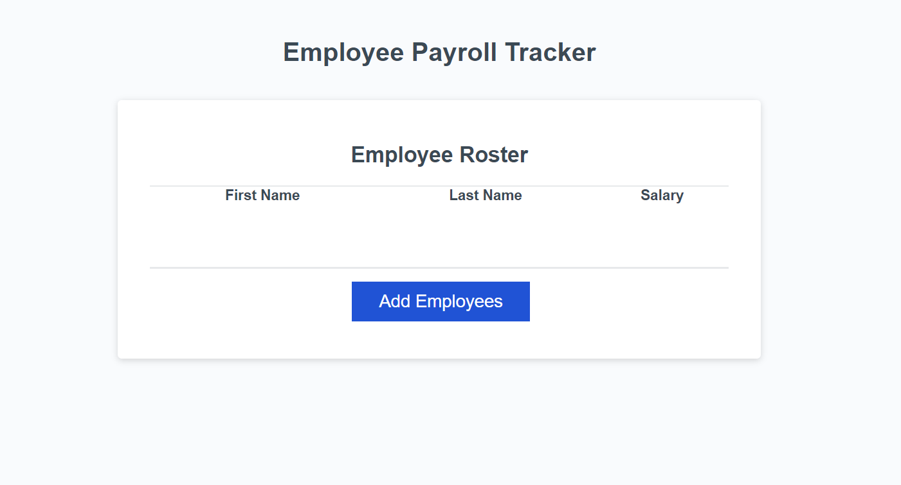

# javascript-payroll-tracker

## Description 

A project created to allow for collection of employee data. Once collected the information is displayed along with an average salary and random employee selector. 

## Usage

To use, enter employee information (first name, last name, salary). Once complete select cancel to end the while loop. In the console log the collected information, the average salary, and a random employee is selected. 

